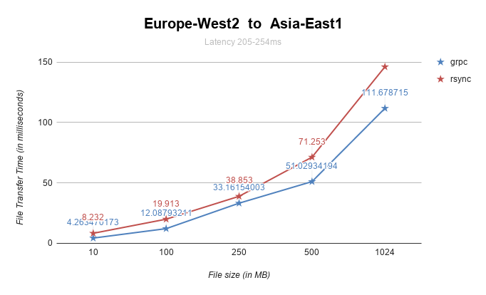
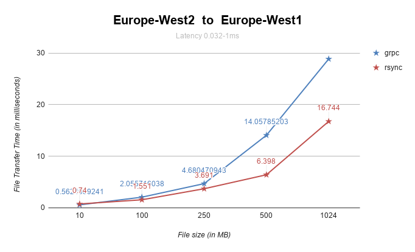
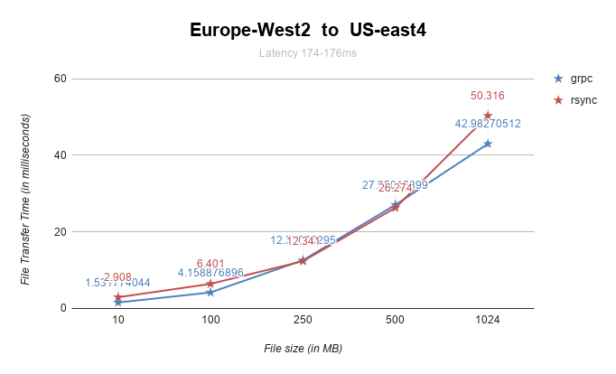

db-sync:
-------
It's a tool to sync data.

Getting started:
---------------
These instructions will get you a copy of the project up and running on your local machine for development and testing purposes. 
See deployment for notes on how to deploy the project on a live system.

Prerequisites:
-------------

Installing:
-----------
A step by step series of examples that tell you have to get a development env running

Running the tests:
------------------

Deployment:
-----------

Add additional notes about how to deploy this on a live system

Built With

Contributing:
------------

Versioning:
----------
We use SemVer for versioning. For the versions available, see the tags on this repository.

Authors:
-------
Dheeraj Bhadani - Initial work
See also the list of contributors who participated in this project.

Acknowledgments:
----------------

